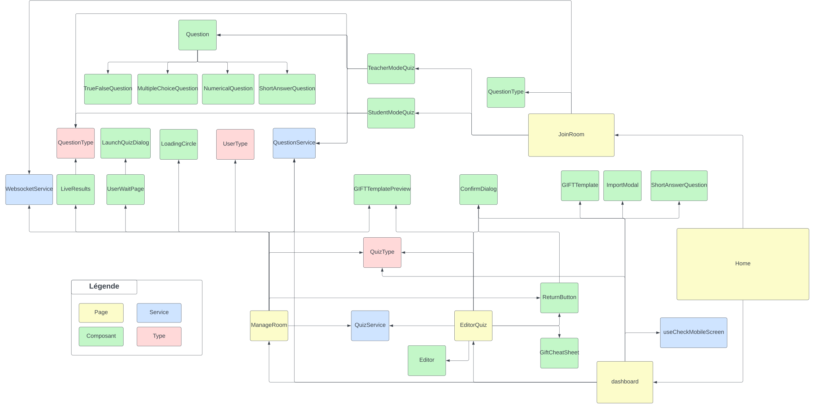
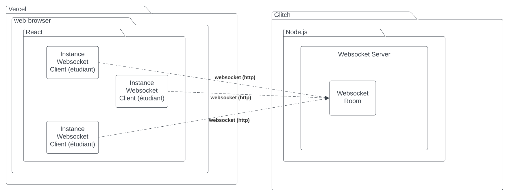
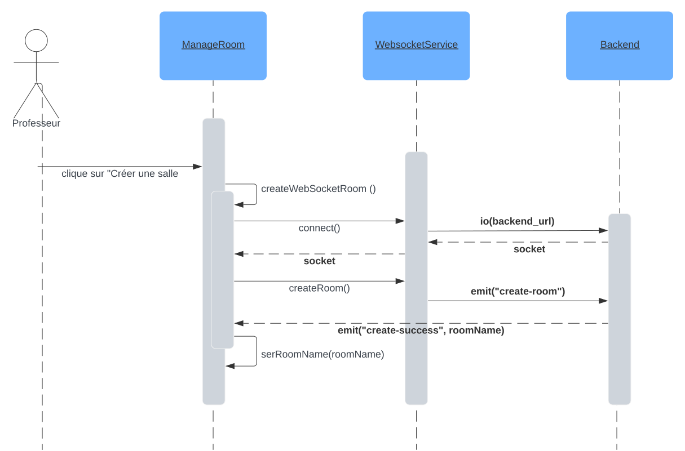
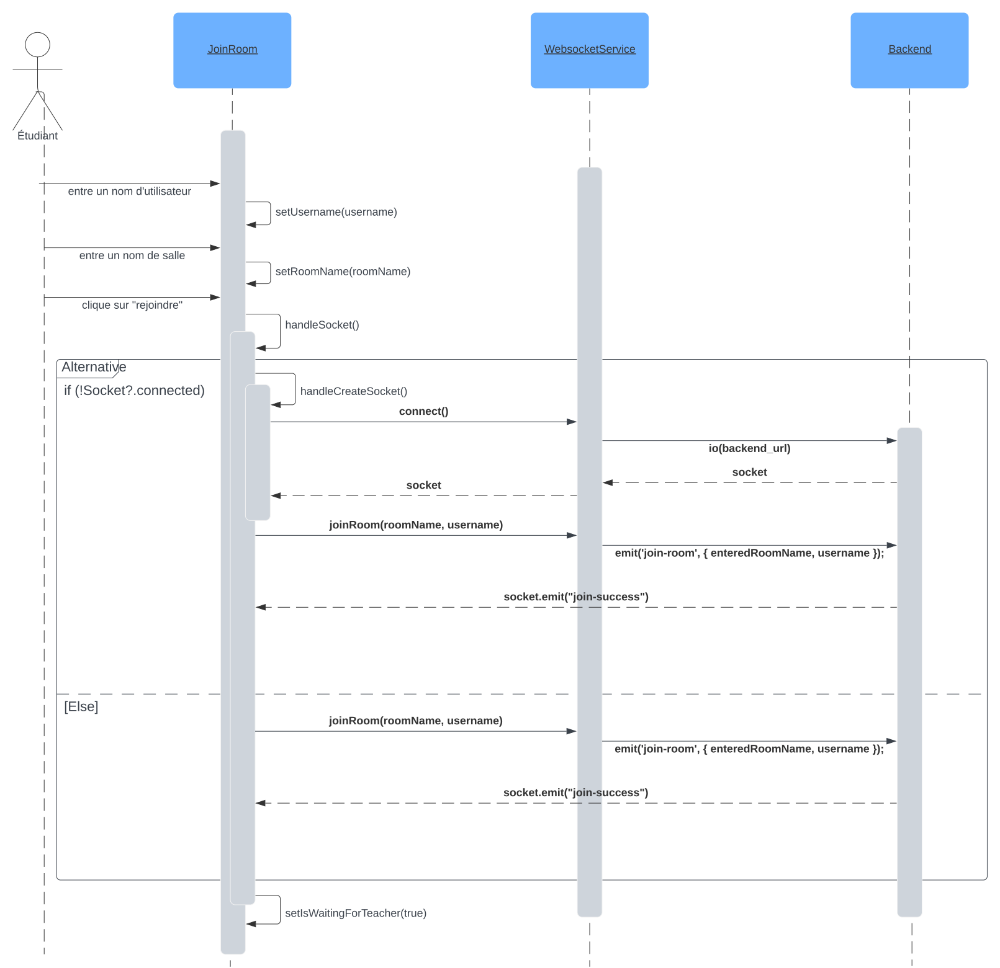
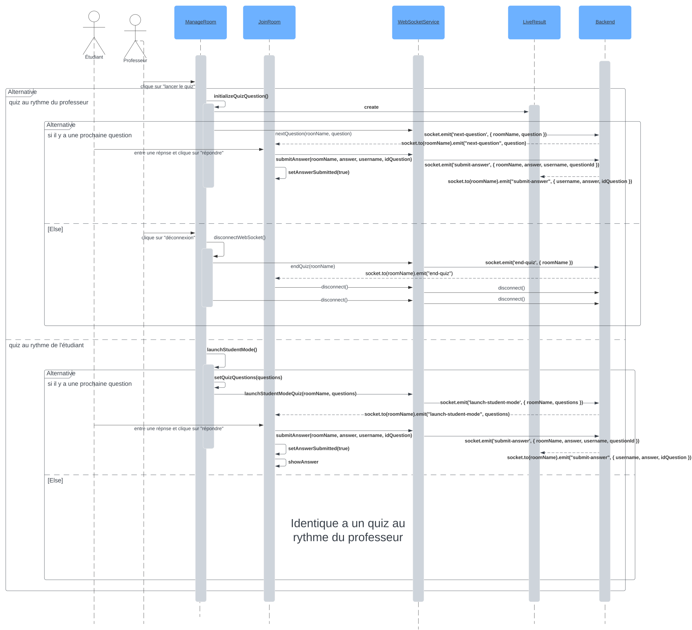

# Plan d'itération 3

## Étapes jalons

| Étape jalon          | Date       |
| :------------------- | :--------- |
| Début de l'itération | 2023/11/17 |
| Démo                 | 2023/12/05 |
| remise du projet     | 2023/12/13 |
| Présentation finale  | 2023/12/13 |
| Fin de l'itération   | 2023/12/13 |

## Objectifs clés

Les objectifs clés de cette itération sont les suivants:

-   Création d'une option de création de quiz au rythme des étudiants
-   Support des images dans les questions
-   Support des formules mathématiques dans les questions
-   Gestion de l'import/export des questionnaires
-   Déploiement d'un prototype de l'application

## Affectations d'éléments de travail

| Nom / Description                                                                                 | Priorité | [Taille estimée (points)](#commentEstimer 'Comment estimer?') | Assigné à (nom)  | Documents de référence | État |
| ------------------------------------------------------------------------------------------------- | -------: | ------------------------------------------------------------: | ---------------- | ---------------------- | ---- |
| Suite a la démo précédente : traduction de l'application de l'anglais vers le Francais            |        2 |                                                             1 | tous             |                        | 🟢   |
| Suite a la démo précédente : import/export des questionnaires                                     |        1 |                                                             4 | Mihai            |                        | 🟢   |
| Suite a la démo précédente : support des images                                                   |        1 |                                                             4 | Paul             |                        | 🟢   |
| Suite a la démo précédente : nom de salle en chiffres                                             |        3 |                                                             1 | Paul             |                        | 🟢   |
| Suite a la démo précédente : reload fonctionnel sur vercel                                        |        1 |                                                             1 | Mihai            |                        | 🟢   |
| Suite a la démo précédente : bouton de déconnexion lorsqu'un quiz est lancé                       |        3 |                                                             1 | Paul             |                        | 🟢   |
| Suite a la démo précédente : support du LateX coté étudiant                                       |        1 |                                                             4 | Francois         |                        | 🟢   |
| Suite a la démo précédente : retour sur une question dans le tableau des résultats en temps reels |        3 |                                                             1 | Paul             |                        | 🟢   |
| déploiement continue des applications                                                             |        3 |                                                             1 | tous             |                        | 🟢   |
| Finaliser les suites de tests et les ajouter aux déploiement continue des application             |        3 |                                                             4 | Bavithra/Emerick |                        | 🟢   |
| Amélioration de l'interface utilisateur                                                           |        4 |                                                             4 | Mihai            |                        | 🟢   |
| Investigation d'une autre solution de déploiement backend                                         |        4 |                                                             4 | tous             |                        | 🟠   |

## Problèmes principaux rencontrés

| Problème                                                                                                                 | Notes                                                                                                                                                                                                                |
| ------------------------------------------------------------------------------------------------------------------------ | -------------------------------------------------------------------------------------------------------------------------------------------------------------------------------------------------------------------- |
| Support de l'image dans l'éditeur de quiz                                                                                | Le support de l'image fonctionne mais nous pensons qu'il peut être amélioré, surtout si on se détache de l'éditeur de questionnaire sous forme de texte                                                              |
| choix de librairie pour les composants visuel                                                                            | Nous avons longtemps hésiter d'utiliser une librairie pour le coté visuel (bootstrap ou autre). Nous avons finalement décidé d'utiliser Material UI. Cela nous permet d'avoir un visuel beaucoup plus professionnel. |
| choix du composant pour l'affichage des questions et choix de réponses coté étudiant                                     | Nous hésitons entre utiliser le composant GIFTTemplate, ou créer un composant spécifique. La seconde solution serait plus intéressante car plus personnalisable mais ajoute de la complexité au developpement.       |
| Les utilisateurs sur téléphones sont déconnecté s'ils sont trop longtemps inactifs et que le téléphone se met en veille. |

## Critères d'évaluation

> Une brève description de la façon d'évaluer si les objectifs (définis plus haut) de haut niveau ont été atteints.
> Vos critères d'évaluation doivent être objectifs (aucun membre de l'équipe ne peut avoir une opinion divergente) et quantifiables (sauf pour ceux évalués par l'auxiliaire d'enseignement). En voici des exemples:

-   Tous les tests unitaires passent (couverture de 80%)
-   Les fonctionnalités discutés durant la derniere démo sont implémentées

## Évaluation

| Résumé             |                                                                                                                                    |
| ------------------ | ---------------------------------------------------------------------------------------------------------------------------------- |
| Cible d'évaluation | Itération                                                                                                                          |
| Date d'évaluation  | 2023/11/16                                                                                                                         |
| Participants       | **Équipe** : Paul Berguin, Mihai Floca, Francois Richard, Bavithra Jeyarasa, Emerick Paul  **professeur** : Christopher Fuhrman |
| État du projet     | 🟢                                                                                                                                 |

### Éléments de travail: prévus vs réalisés

Tous les éléments de travail prévus ont été réalisés. Nous avons aussi complêtement retravailler l'interface utilisateur pour la rendre plus professionnelle.
De plus nous avons une couverture de test très satisfaisante.
Enfin, nous avons intégré un système de déploiement continue pour le backend et le frontend.

### Évaluation par rapport aux résultats selon les critères d'évaluation

## Autres préoccupations et écarts

## Retour des promoteurs suite à la démo

# Principaux diagrammes

## Diagramme de classe

## Diagramme de déploiement

## Diagramme de séquence - Création d'une salle

## Diagramme de séquence - Rejoindre une salle

## Diagramme de séquence - déroulement d'un quiz

<a name="commentEstimer">Comment estimer la taille :</a>
<https://docs.google.com/a/etsmtl.net/document/d/1bDy0chpWQbK9bZ82zdsBweuAgNYni3T2k79xihr6CuU/edit?usp=sharing>
